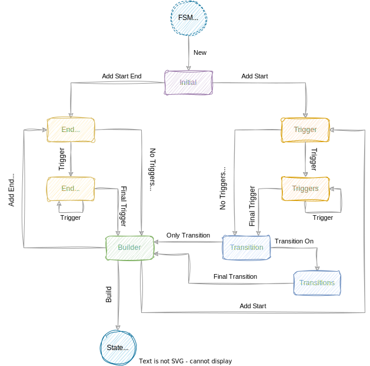
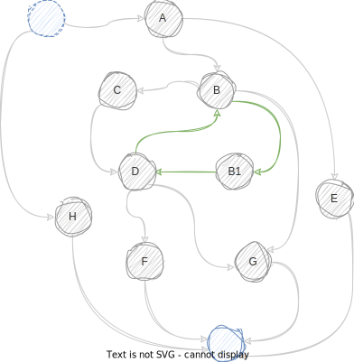

# Stately

Stately is a [finite state machine] library

## Usage

```toml
[dependencies]
staley = "0.1"
```

## Features

### Fluent Builder

Using Rust's powerful type system this library provides a fluent builder that validates
a lot of the state machine definition at compile time. The builder itself phases through
states to contextually provide only the necessary api for defining a state machine,
reducing the number of validations required at runtime.

#### Compile Time Validation

By splitting the builder into multiple states, the api provides a contextually relevant
builder; that allows it to make some compile time assumptions of the validity of the
state(s) being defined.

_for instance, it ensures that every non-end state has at least one transition edge defined_

<br>
<div>
    
</div>
<br>

> **each state represents a phase of the builder, and it's contextual api**; _illustrated by the edges_

<br>

#### Run Time Validation

Not all the validations of the state machine can be reasoned about at compile time.

Validation also occurs during various state machine definition operations and then at
the final `build` operation.

It is possible to end up with the following invalid state machine definition issues;

* State Definition Validations
    * Duplicate states
    * Duplicate state transitions
    * _and_ Redefinition of the `Initial` state
* Build Validations
    * Unreachable states
    * Undefined states

### Detecting Cycles

A [`FiniteStateMachine<TState, TEvent>`] is a directed graph, and it is possible to define
[cyclical] states, the [`has_cycle`] method checks if a cycle exists.

## Example

This example demonstrates all the possible definable state machine components;

* start state(s) \[A\]
* start end state(s) \[H\]
* end state(s) \[G, F, E\]
* state(s) \[B, B1, C, D\],
* single transitions
* multiple transitions
* _triggers are optional_
* and a cycle

<div>

</div>

```rust
use std::fmt::{Display, Formatter};
use stately::builder;
use stately::prelude::*;

use crate::Event::*;
use crate::State::*;

type BuilderResult = builder::Result<(), State, Event>;

fn main() -> BuilderResult {
    // start with a new builder and an initial value
    let example = StateMachineBuilder::new()
        .add_start_state(Start, A)?
            .no_triggers()
            .transition_on(Done, E)?
            .final_transition_on(Next, B)?
        .add_end_state(E)?
            .no_triggers()
        .add_state(B)?
            .no_triggers()
            .transition_on(Next, C)?
            .transition_on(Loop, B1)?
            .final_transition_on(Done, G)?
        .add_state(B1)?
            .no_triggers()
            .only_transition_on(Next, D)?
        .add_state(C)?
            .no_triggers()
            .only_transition_on(Next, D)?
        .add_state(D)?
            .no_triggers()
            .transition_on(Next, F)?
            .transition_on(Loop, B)?
            .final_transition_on(Done, G)?
        .add_end_state(F)?
            .no_triggers()
        .add_end_state(G)?
            .no_triggers()
        .add_start_end_state(Skip, H)?
            .no_triggers()
        .build()?;

    let mut state_machine = example.create();

    assert!(state_machine.has_cycles().expect("fsm should have cycles"));
    assert_eq!(Initial, state_machine.current_state());

    Ok(())
}

#[derive(Copy, Clone, Debug, Eq, PartialEq, Hash)]
pub enum Event {
    Done,
    Loop,
    Next,
    Skip,
    Start,
}

#[derive(Copy, Clone, Default, Debug, Eq, PartialEq, Hash)]
enum State {
    #[default]
    Initial,
    A,
    B,
    B1,
    C,
    D,
    E,
    F,
    G,
    H,
}
```

## Road Map

*  ### `Core` crate features;

* [x] ~~Initial implementation~~
* [x] ~~Add `build` validation logic~~
* [x] ~~Add state definition reflection from metadata~~
* [x] ~~Refactor; separate out state machine definite, into singleton, from actual state instance~~
* [x] ~~Refactor; Add re-trigger implementation to state instance~~
* [x] ~~Refactor; apply stricter clippy rules; a.k.a "Clippify" project~~
* [x] ~~detect cyclical loops~~
* [x] ~~Add unit tests~~
* [ ] Rust Docs
* [x] Add working example

*  ### `Feature` gated expansion;

* [ ] Support for embedded state machine
* [ ] Implement derive macro configuration
* [ ] Implement expression macro dsl
* [ ] Generate [Mermaid] diagrams

[finite state machine]: https://en.wikipedia.org/wiki/Finite-state_machine
[`BuildError`]: src/builder/error.rs
[`FiniteStateMachine<TState, TEvent>`]: FiniteStateMachine
[cyclical]: https://en.wikipedia.org/wiki/Cycle_(graph_theory)
[`has_cycle`]: src/state_machine/mod.rs
[Mermaid]: https://mermaid.js.org/syntax/stateDiagram.html
