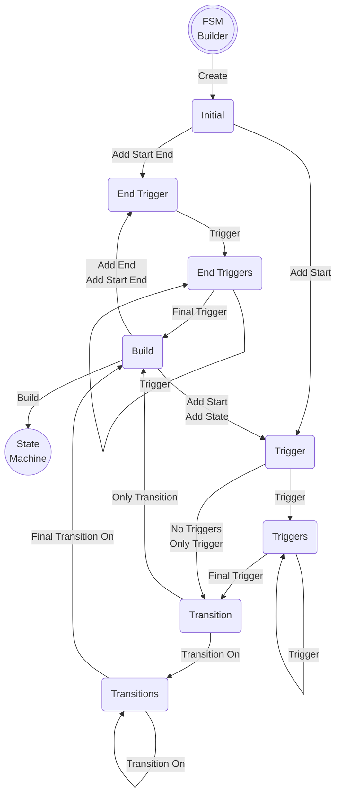

**State Machine Builder - States**

This state machine of a state machine builder encapsulates the build rules.

Each state is an implementation `trait`[*]() which provides partial[**]() compile time validation.

_* see the [`build_states`](../src/builder/build_states) for all the traits that are used to implement this state diagram_

_** additional [runtime validations](../src/builder/build_states/builder.rs) are required to ensure a valid state machine_