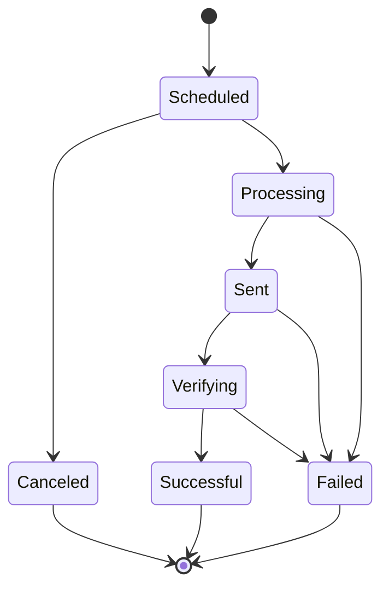
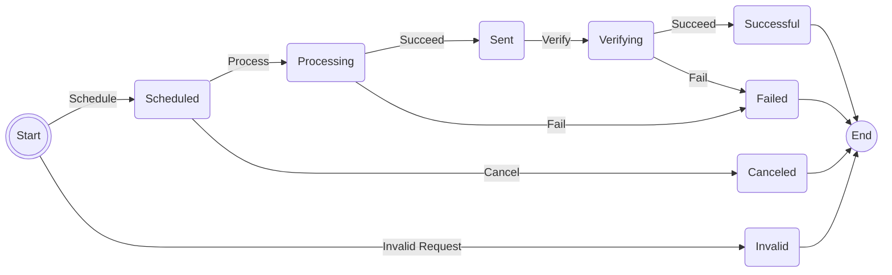

1. Schedule Batched eMail Requested
1. Validate Request
    * Validate Function ID; _Not blank_
    * Validate Batch; _required ? Not blank : Provided ?? Generate New Batch_
    * Validate Recipient(s); _At least one_, _none invalid_
    * Validate Subject; _required ? Not blank : Body not blank_
    * Validate Body; _required ? Not blank : Subject not blank_
1. Valid Request
    * <u>Schedule</u> Request; **Scheduled**
    * Signal Email Processor
    * Respond **Scheduled**
1. Invalid Request
    * Respond ***Error***

1. Builder
    1. Add Start State
        * Add Transition
            * Add Trigger
            * Add Transition
            * Add Last Transition
                * Add Trigger
        * Add Only Transition
            * Add Trigger
        * Add Trigger
    1. Add State
        * Add Transition
            * Add Trigger
            * Add Transition
            * Add Last Transition
                * Add Trigger
        * Add Only Transition
            * Add Trigger
        * Add Trigger
    1. Add End State
        * Add Trigger
