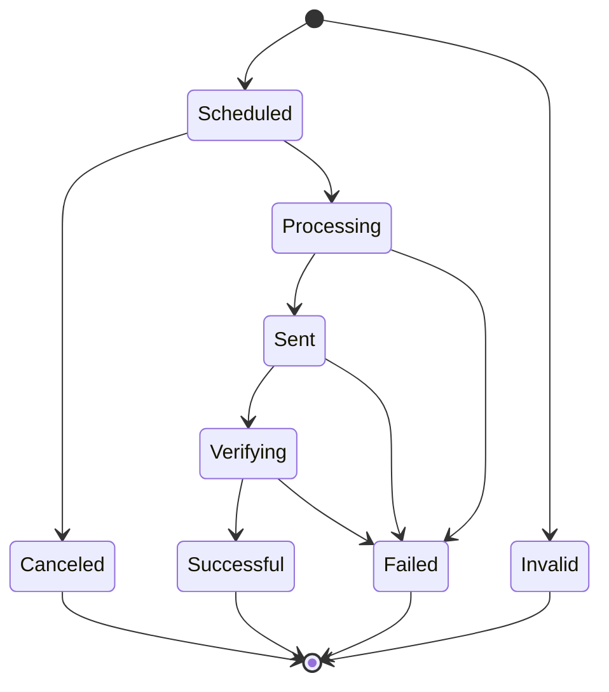
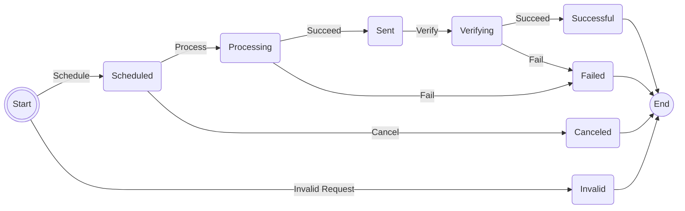
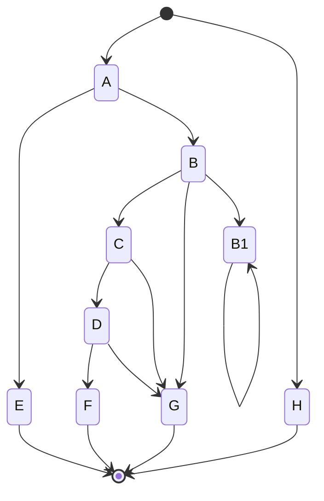

```mermaid
stateDiagram-v2
    [*] --> Scheduled
    Scheduled --> Canceled
    Scheduled --> Processing
    Processing --> Sent
    Processing --> Failed
    Sent --> Verifying
    Verifying --> Successful
    Verifying --> Failed
    Successful --> [*]
    Sent --> Failed
    Failed --> [*]
    Canceled --> [*]
    [*] --> Invalid
    Invalid --> [*]
```

```mermaid
flowchart LR
    A(((Start))) -- Schedule --> B(Scheduled)
    B -- Process --> E(Processing)
    E -- Succeed --> F(Sent)
    F -- Verify --> H(Verifying)
    H -- Succeed --> I(Successful)
    H -- Fail --> G
    E -- Fail --> G(Failed)
    B -- Cancel --> D(Canceled)
    A(((Start))) -- Invalid Request --> C(Invalid)
    I --> Z((End))
    G --> Z
    D --> Z
    C --> Z
```

```mermaid
stateDiagram-v2
    [*] --> A
    A --> E
    A --> B
    B --> C
    B --> G
    B --> B1
    B1 --> B1
    C --> D
    D --> F
    D --> G
    F --> [*]
    C --> G
    G --> [*]
    E --> [*]
    [*] --> H
    H --> [*]
```