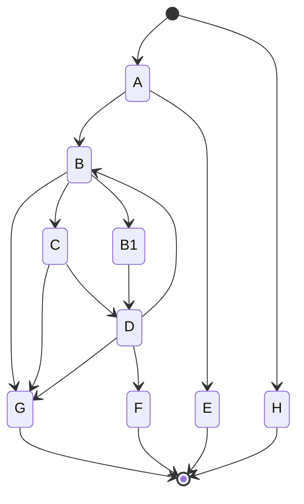

# Cyclical



```rust
    let state_machine = StateMachineBuilder::new(Initial)
        .add_start_state(Start, A)?
            .only_trigger(started)
            .transition_on(Done, E)?
            .final_transition_on(Next, B)?
        .add_end_state(E)?
            .only_trigger(completed)
        .add_state(B)?
            .only_trigger(transitioned)
            .transition_on(Next, C)?
            .transition_on(Loop, B1)?
            .final_transition_on(Done, G)?
        .add_state(B1)?
            .only_trigger(transitioned)
            .only_transition_on(Next, D)?
        .add_state(C)?
            .only_trigger(transitioned)
            .only_transition_on(Next, D)?
        .add_state(D)?
            .only_trigger(transitioned)
            .transition_on(Next, F)?
            .transition_on(Loop, B)?
            .final_transition_on(Done, G)?
        .add_end_state(F)?
            .only_trigger(completed)
        .add_end_state(G)?
            .only_trigger(completed)
        .add_start_end_state(Skip, H)?
            .only_trigger(start_completed)
        .build()?;

    let mut state = state_machine.create();
```

## Example

Run example using

```shell
cargo run --package stately --bin cyclical
```

### Example Output

Successful conclusion

```
◉ |Start| → A ━ |Next| → B ━ |Next| → C ━ |Next| → D ━ |Next| → F ●
```

Invalid conclusion

```
◉ |Skip| → H ●
```