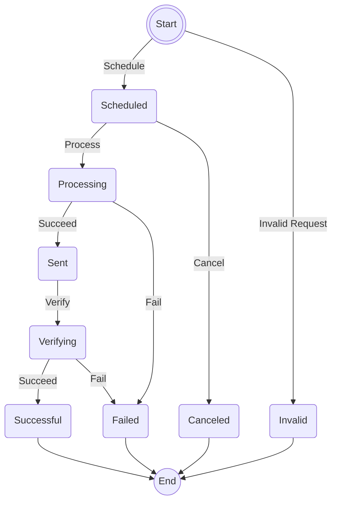

# EMails

State machine for processing emails.



```rust
    let email_state_machine = StateMachineBuilder::new(Initial)
        .add_start_state(Schedule, Scheduled)?
            .only_trigger(started)
            .transition_on(Cancel, Canceled)?
            .final_transition_on(Process, Processing)?
        .add_end_state(Canceled)?
            .only_trigger(completed)
        .add_state(Processing)?
            .only_trigger(transitioned)
            .transition_on(Succeed, Sent)?
            .final_transition_on(Fail, Failed)?
        .add_state(Sent)?
            .only_trigger(transitioned)
            .only_transition_on(Verify, Verifying)?
        .add_state(Verifying)?
            .only_trigger(transitioned)
            .transition_on(Succeed, Successful)?
            .final_transition_on(Fail, Failed)?
        .add_end_state(Successful)?
            .only_trigger(completed)
        .add_end_state(Failed)?
            .only_trigger(completed)
        .add_start_end_state(InvalidRequest, Invalid)?
            .only_trigger(start_completed)
        .build()?;

    let mut email_state = email_state_machine.create();
```

## Example

Run example using

```shell
cargo run --package stately --bin emails
```

### Example Output
Successful conclusion
```
◉ |Schedule| → Scheduled ━ |Process| → Processing ━ |Succeed| → Sent ━ |Verify| → Verifying ━ |Succeed| → Successful ●
```

Invalid conclusion
```
◉ |InvalidRequest| → Invalid ●
```
