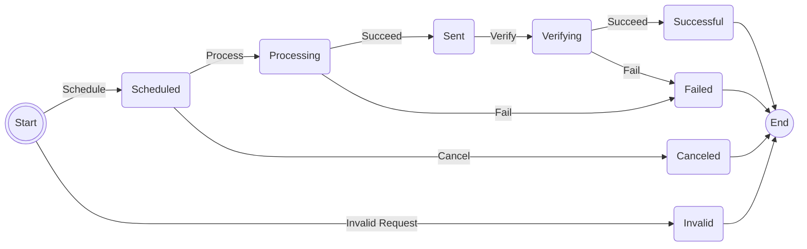

# EMails

State machine for processing emails.



## Example

Run example using

```shell
cargo run --package stately --bin emails
```

### Example Output
Successful conclusion
```
◉ |Schedule| → Scheduled ━ |Process| → Processing ━ |Succeed| → Sent ━ |Verify| → Verifying ━ |Succeed| → Successful ●
```

Invalid conclusion
```
◉ |InvalidRequest| → Invalid ●
```